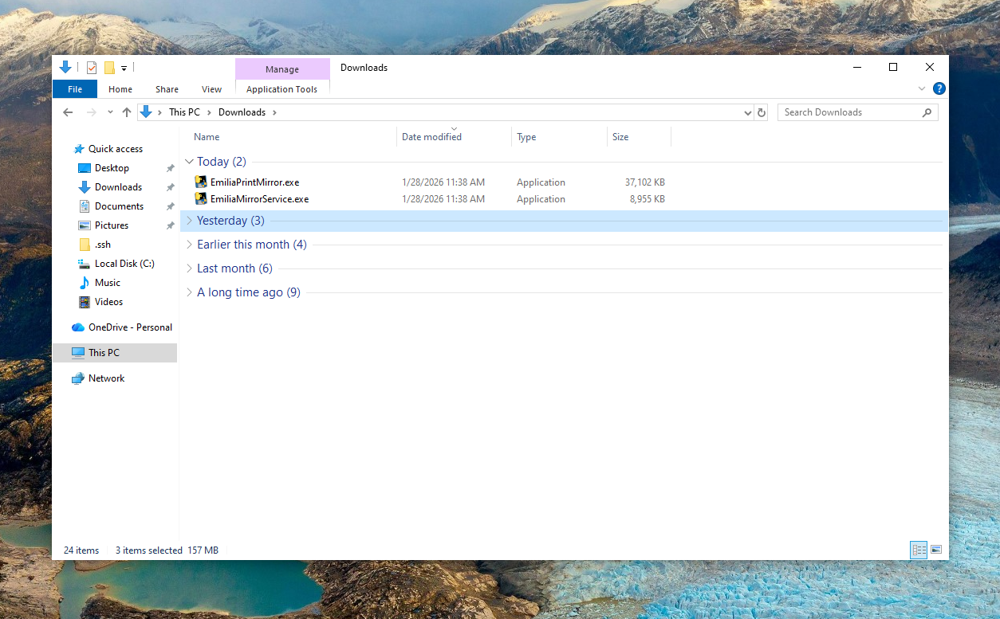
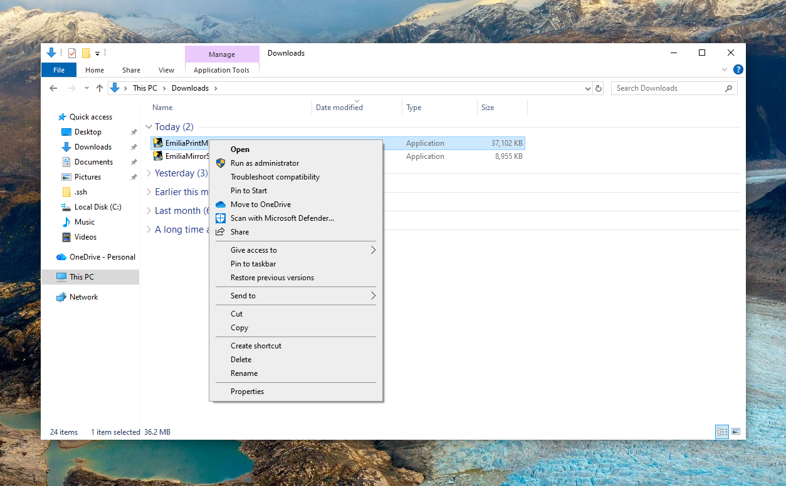
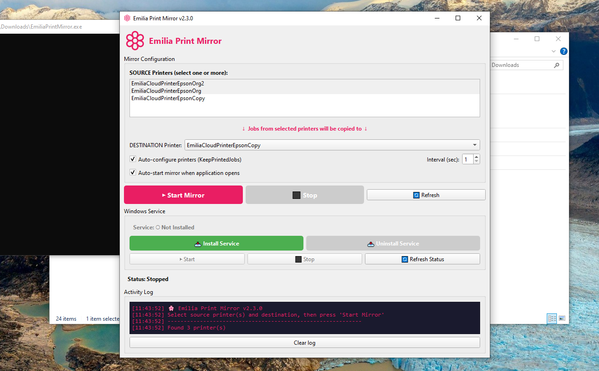
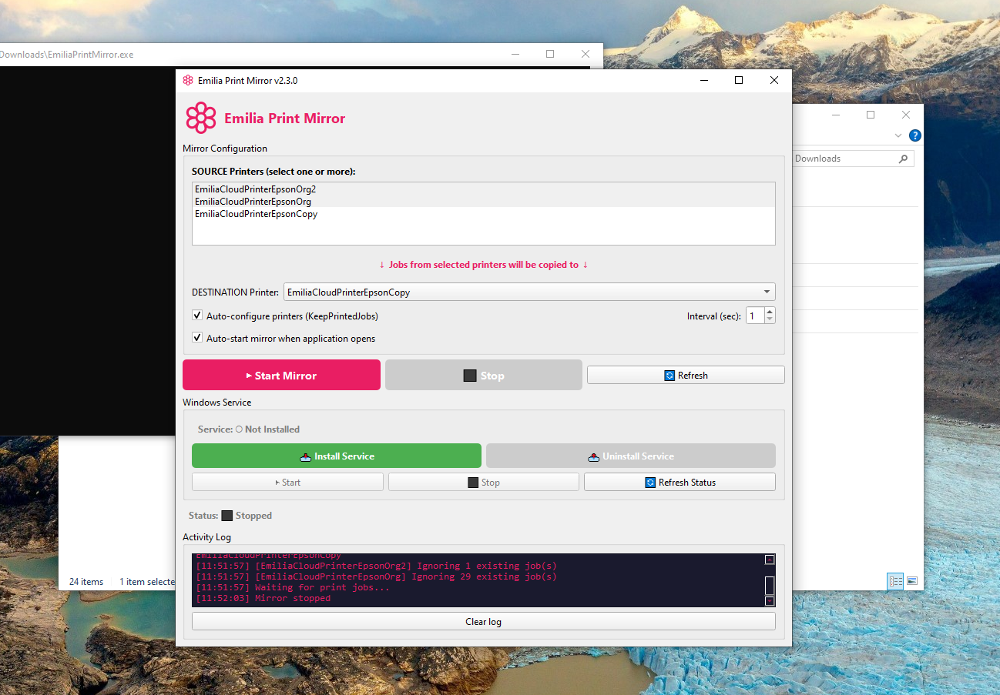

# Installation Guide

Visual step-by-step guide to install Emilia Print Mirror.

## Step 1: Download

Download both executables from the [latest release](https://github.com/EmiliaVision/emilia-print-mirror/releases/latest):

- `EmiliaPrintMirror.exe` (GUI application - 37MB)
- `EmiliaMirrorService.exe` (Background service - 9MB)

Save both files in the same folder (e.g., Downloads).



## Step 2: Run as Administrator

Right-click on `EmiliaPrintMirror.exe` and select **"Run as administrator"**.

> Administrator privileges are required to:
> - Access the Windows print spooler
> - Install the Windows service



## Step 3: Configure Printers

The GUI will open showing your available printers:

1. **SOURCE Printers**: Select one or more printers to monitor (Ctrl+click for multiple)
2. **DESTINATION Printer**: Select where jobs will be copied to
3. Leave **"Auto-configure printers"** checked to automatically enable KeepPrintedJobs



## Step 4: Test with GUI Mode (Optional)

Before installing the service, you can test the mirroring using the GUI:

1. Click **"Start Mirror"**
2. Print something to one of the source printers
3. Check the Activity Log to see if jobs are being copied


## Step 5: Install Windows Service

For automatic background mirroring (recommended):

1. Select your source and destination printers
2. Click **"Install Service"** in the Windows Service section



The application will:
- Save configuration to `C:\ProgramData\EmiliaPrintMirror\config.json`
- Copy `EmiliaMirrorService.exe` to `C:\Program Files\EmiliaPrintMirror\`
- Register and start the Windows service


## Step 6: Verify Service is Running

After installation:
- **Service status** should show "Running" (green)
- The service will start automatically when Windows boots
- You can close the GUI - the service continues running in the background

## Managing the Service

From the GUI you can:
- **Start/Stop** the service
- **Uninstall** the service
- **Refresh Status** to check current state

Or use Windows Services (services.msc) to manage "Emilia Print Mirror Service".

## Service Logs

Logs are stored at:
```
C:\ProgramData\EmiliaPrintMirror\service.log
```

## Troubleshooting

### "Access Denied" when installing
- Make sure you ran the GUI as Administrator

### Service won't start
- Check the log file for errors
- Verify printers exist and are accessible

### Jobs not being copied
- Ensure KeepPrintedJobs is enabled on source printers
- Check that the destination printer is online
